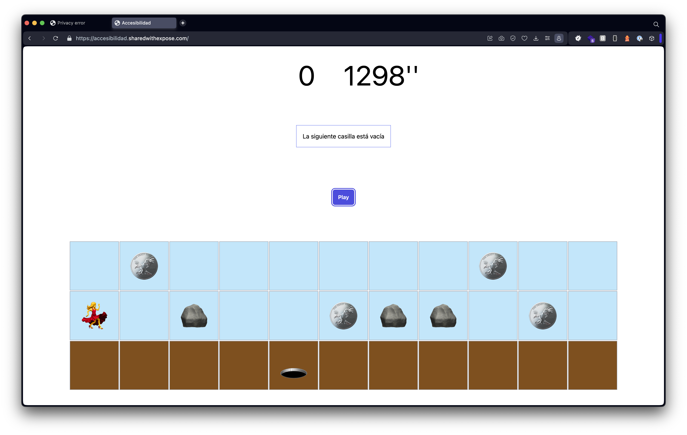
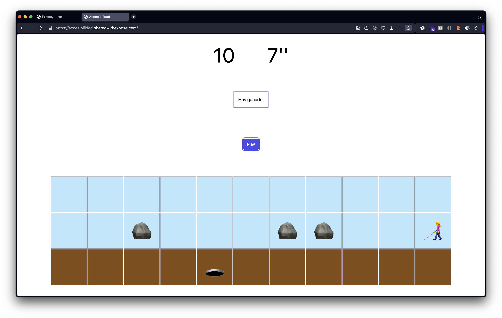

# Juego accesible

Ejecutar composer install

Las instrucciones del juego son:

<ul class="mt-4" role="menu">
    Si pulsas:
    <li>Shift: Preguntas que hay alrededor</li>
    <li>Flecha derecha: avanzas hacia la derecha</li>
    <li>Flecha izquierda: avanzas hacia la izquierda</li>
    <li>Espacio: Saltas</li>
    <li>Flecha arriba: subes sin avanzar</li>
</ul>

